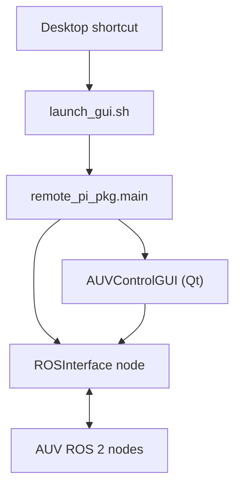
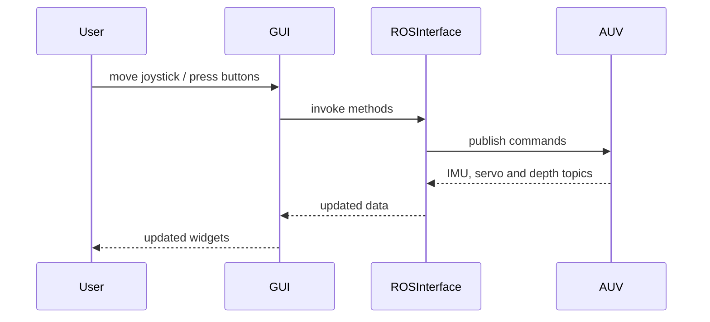

# RemotePiRos2

RemotePiRos2 provides a PyQt-based GUI for remotely controlling an AUV running ROS&nbsp;2. It packages a desktop shortcut, launch scripts and a Python package containing the GUI and ROS&nbsp;2 interface code.

## Project layout

```
RemotePiRos2/
├── assets/                     # Application icons and background
├── install_shortcut.sh         # Create local desktop entry
├── launch_gui.sh               # Start GUI with ROS environment
├── shortcuts/                  # Example desktop entry
└── src/
    ├── auv_custom_interfaces/  # Custom ROS 2 message definitions
    │   └── msg/ServoMovementCommand.msg
    └── remote_pi_pkg/          # Python package implementing the GUI
        ├── main.py             # Entry point executed by `ros2 run`
        ├── auv_control_gui.py  # Qt widget hierarchy for the GUI
        ├── ros/                # ROS 2 helper nodes
        │   ├── interface.py        # Main ROS<->GUI bridge
        │   ├── fake_imu_publisher.py  # IMU data generator for testing
        │   └── underwater_conditions.py # Simple underwater IMU simulator
        └── widgets/            # Custom Qt widgets
            ├── virtual_joystick.py
            ├── heading_bar.py
            ├── attitude_indicator.py
            └── control_status_field.py
```

## Quick start

1. Build the workspace:
   ```bash
   colcon build
   ```
2. Install a desktop shortcut (optional):
   ```bash
   ./install_shortcut.sh
   ```
3. Launch the GUI:
   ```bash
   ./launch_gui.sh
   ```

The script sources `/opt/ros/jazzy/setup.bash` and the workspace's `install/setup.bash`, then runs `ros2 run remote_pi_pkg auv_control`. The `auv_control` entry point automatically starts `joy_linux` and the internal gamepad mapper so joystick input is available without additional commands.

## ROS 2 overview

The GUI communicates with the AUV through a ROS&nbsp;2 node implemented in [`ros/interface.py`](src/remote_pi_pkg/remote_pi_pkg/ros/interface.py). The relationships between the main pieces are shown below.



### Published topics

- `/target_roll` (`Float32`)
- `/target_pitch` (`Float32`)
- `/servo_interpolation_commands` (`ServoMovementCommand`)
- `/wing_pid_active` (`Bool`)

### Subscribed topics

- `/current_servo_angles` (`Float32MultiArray`)
- `/imu/data` (`Imu`)
- `/imu/heading` (`String`)
- `/imu/euler` (`Vector3`)
- `/imu/health_status` (`String`)
- `/servo_driver/lifecycle_state` (`String`)
- `/servo_driver_status` (`String`)
- `/depth` (`Float32`)
- `/acceleration/processed` (`Vector3`)

### Services

- `/servo_driver_node/change_state` (`ChangeState`)
- `/servo_driver_node/get_state` (`GetState`)

These allow the GUI to manage the servo driver node's lifecycle (configure, activate, deactivate, etc.).

## File descriptions

### Root scripts

- **`install_shortcut.sh`** – creates `~/RemotePiRos2/launch_gui.sh` and a desktop entry so the GUI can be launched from the system menu. It also copies the application icon.
- **`launch_gui.sh`** – sets the necessary environment variables and starts the GUI via `ros2 run remote_pi_pkg auv_control`.

### Custom message package

[`ServoMovementCommand.msg`](src/auv_custom_interfaces/msg/ServoMovementCommand.msg) defines an extended command for sending complex servo movements to the AUV.

### GUI package (`remote_pi_pkg`)

- **`main.py`** – initializes rclpy, spins `ROSInterface` in a background thread and starts the Qt application defined in `auv_control_gui.py`.
- **`auv_control_gui.py`** – builds the Qt GUI. It presents operation tabs, manual movement controls and status fields. Widgets update in real time from ROS topics and send commands through `ROSInterface`.
- **`ros/interface.py`** – core ROS node which publishes target roll/pitch values, sends servo interpolation commands, and receives telemetry. It manages the servo driver lifecycle through services.
- **`ros/underwater_conditions.py`** and **`ros/fake_imu_publisher.py`** – standalone ROS nodes useful for testing the GUI without real hardware. They periodically publish simulated IMU readings.
- **Widgets** – the `widgets/` directory contains custom Qt widgets:
  - `virtual_joystick.py` – joystick that emits normalized roll/pitch commands.
  - `heading_bar.py` – HUD-style heading indicator.
  - `attitude_indicator.py` – graphical pitch/roll indicator with depth display.
- `control_status_field.py` – text area summarizing command and sensor data.
- Settings tab includes a PID control section for manual PID toggles and automatic re-engagement.

## Interactions

The diagram below shows how user input and telemetry flow through the system.



`ROSInterface` ensures that commands from the GUI are translated into ROS&nbsp;2 messages and that incoming telemetry updates the GUI. The optional simulators can replace the real AUV during development.

## Testing

Unit tests are provided under `src/remote_pi_pkg/test/`. They use `ament_flake8` and `ament_pep257` to enforce style guidelines. Run them with:

```bash
colcon test --packages-select remote_pi_pkg
```

## License

See individual files for license information.
