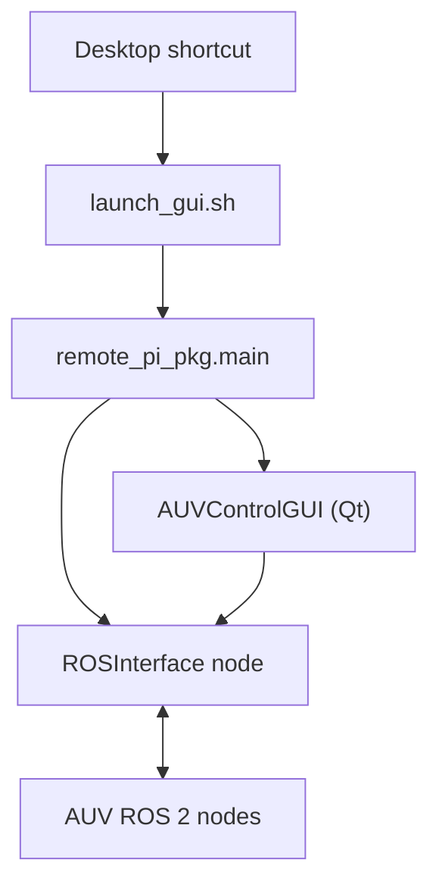
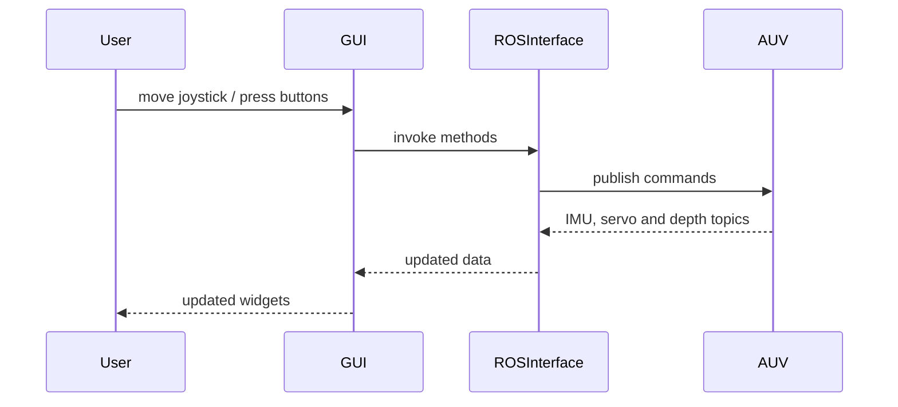

# RemotePiRos2

RemotePiRos2 provides a PyQt-based GUI for remotely controlling an AUV running ROS&nbsp;2. It packages a desktop shortcut, launch scripts and a Python package containing the GUI and ROS&nbsp;2 interface code.

## Project layout

```
RemotePiRos2/
├── assets/                     # Application icons and background
├── install_shortcut.sh         # Create local desktop entry
├── launch_gui.sh               # Start GUI with ROS environment
├── shortcuts/                  # Example desktop entry
└── src/
    ├── auv_custom_interfaces/  # Custom ROS 2 message definitions
    │   └── msg/ServoMovementCommand.msg
    └── remote_pi_pkg/          # Python package implementing the GUI
        ├── main.py             # Entry point executed by `ros2 run`
        ├── auv_control_gui.py  # Qt widget hierarchy for the GUI
        ├── ros/                # ROS 2 helper nodes
        │   ├── interface.py        # Main ROS<->GUI bridge
        │   ├── fake_imu_publisher.py  # IMU data generator for testing
        │   └── underwater_conditions.py # Simple underwater IMU simulator
        └── widgets/            # Custom Qt widgets
            ├── virtual_joystick.py
            ├── heading_bar.py
            ├── attitude_indicator.py
            └── control_status_field.py
```

## Quick start

1. Build the workspace:
   ```bash
   colcon build
   ```
2. Install a desktop shortcut (optional):
   ```bash
   ./install_shortcut.sh
   ```
3. Launch the GUI:
   ```bash
   ./launch_gui.sh
   ```

The script sources `/opt/ros/jazzy/setup.bash` and the workspace's `install/setup.bash`, then runs `ros2 run remote_pi_pkg auv_control`.

## ROS 2 overview

The GUI communicates with the AUV through a ROS&nbsp;2 node implemented in [`ros/interface.py`](src/remote_pi_pkg/remote_pi_pkg/ros/interface.py). The relationships between the main pieces are shown below.


```mermaid
graph TD;
    desktop["Desktop shortcut"] --> launch_gui["launch_gui.sh"];
    launch_gui --> main["remote_pi_pkg.main"];
    main --> gui["AUVControlGUI (Qt)"];
    main --> rosnode["ROSInterface node"];
    gui --> rosnode;
    rosnode <--> auv["AUV ROS 2 nodes"];
```

### Published topics

- `/target_roll` (`Float32`)
- `/target_pitch` (`Float32`)
- `/servo_interpolation_commands` (`ServoMovementCommand`)
- `/wing_pid_active` (`Bool`)

### Subscribed topics

- `/current_servo_angles` (`Float32MultiArray`)
- `/imu/data` (`Imu`)
- `/imu/heading` (`String`)
- `/imu/euler` (`Vector3`)
- `/imu/health_status` (`String`)
- `/servo_driver/lifecycle_state` (`String`)
- `/servo_driver_status` (`String`)
- `/depth` (`Float32`)
- `/acceleration/processed` (`Vector3`)

### Services

- `/servo_driver_node/change_state` (`ChangeState`)
- `/servo_driver_node/get_state` (`GetState`)

These allow the GUI to manage the servo driver node's lifecycle (configure, activate, deactivate, etc.).

## File descriptions

### Root scripts

- **`install_shortcut.sh`** – creates `~/RemotePiRos2/launch_gui.sh` and a desktop entry so the GUI can be launched from the system menu. It also copies the application icon.
- **`launch_gui.sh`** – sets the necessary environment variables and starts the GUI via `ros2 run remote_pi_pkg auv_control`.

### Custom message package

[`ServoMovementCommand.msg`](src/auv_custom_interfaces/msg/ServoMovementCommand.msg) defines an extended command for sending complex servo movements to the AUV.

### GUI package (`remote_pi_pkg`)

- **`main.py`** – initializes rclpy, spins `ROSInterface` in a background thread and starts the Qt application defined in `auv_control_gui.py`.
- **`auv_control_gui.py`** – builds the Qt GUI. It presents operation tabs, manual movement controls and status fields. Widgets update in real time from ROS topics and send commands through `ROSInterface`.
- **`ros/interface.py`** – core ROS node which publishes target roll/pitch values, sends servo interpolation commands, and receives telemetry. It manages the servo driver lifecycle through services.
- **`ros/underwater_conditions.py`** and **`ros/fake_imu_publisher.py`** – standalone ROS nodes useful for testing the GUI without real hardware. They periodically publish simulated IMU readings.
- **Widgets** – the `widgets/` directory contains custom Qt widgets:
  - `virtual_joystick.py` – joystick that emits normalized roll/pitch commands.
  - `heading_bar.py` – HUD-style heading indicator.
  - `attitude_indicator.py` – graphical pitch/roll indicator with depth display.
  - `control_status_field.py` – text area summarizing command and sensor data.

## Interactions

The diagram below shows how user input and telemetry flow through the system.


```mermaid
sequenceDiagram
    participant User
    participant GUI
    participant ROSInterface
    participant AUV

    User->>GUI: move joystick / press buttons
    GUI->>ROSInterface: invoke methods
    ROSInterface->>AUV: publish commands
    AUV-->>ROSInterface: IMU, servo and depth topics
    ROSInterface-->>GUI: updated data
    GUI-->>User: updated widgets
```

`ROSInterface` ensures that commands from the GUI are translated into ROS&nbsp;2 messages and that incoming telemetry updates the GUI. The optional simulators can replace the real AUV during development.

## Servo Numbers, Location, Function and range for actuation

View Frame: 
The relative description for the servos uses numbers from 0 to 5 at the moment. And when referring to left and right, its from the perspective as one rides a car, meaning, as if we were inside the auv looking forward. With this in mind, the servo relative positions are the following:

Servo Number 0: Location: Left. Main servo that controls the flapping motion of the left wing. Angle range: 0 to 180, where 0 is uppermost angle, and 180 the lowermost angle of the flapping motion, and 90 is the gliding position or neutral position, stretched outwards to the sides.

Servo Number 1: Location Left. Pitch servo, that controls the attack angle of the left wing, rotating the distal two thirds section of the wing, lifting or lowering the trailing edge of the wing's section. Adjusting the angle of attack affects the magnitud of the thrust produced by the flapping motion, and when gliding, via differential actuation controls roll of the auv. Angle range: 90 to 180, with 135 being the center. For this servo, moving the servo to angle 180 lowers the trailing edge of the wing's control surface to its lower limit, and 90 lifts the trailing edge of the control surface to its upper limit. Therefore, if the left wing was swinging upwards and we wanted to create forward thrust, we would lower the trailing edge anywhere between 135 (neutral position) to 180 (lowermost position for the trailing edge). The closer the angle is to 135 the more thrust the wing will produce, but the energy requirements for the swing motion on the main servos will increase. Likewise, the further the angle of attack is from 135 towards on of its lower or uppermost limits, the less thrust the swinging motion will produce, but the energy requirements for the main servos to swing the wings will be reduced. If we wanted to generate roll to the right via actuation of the pitch servo of the left wing, we would also lower the trailing edge of the left wing accordingly, assuming we are moving forward. 

Servo Number 2: Location: Right. Main servo that controls the flapping motion of the right wing. Angle range: 0 to 180, where 0 is lowermost angle, and 180 the uppermost angle of the flapping motion, and 90 is the gliding position or neutral position, stretched outwards to the sides.

Servo Number 3: Location Right. Pitch servo, that controls the attack angle of the right wing, rotating the distal two thirds section of the wing, lifting or lowering the trailing edge of the wing's section. Adjusting the angle of attack affects the magnitud of the thrust produced by the flapping motion, and when gliding, via differential actuation controls roll of the auv. Angle range: 90 to 180, with 135 being the center. For this servo, moving the servo to angle 90 lowers the trailing edge of the wing's control surface to its lower limit, and 180 lifts the trailing edge of the control surface to its upper limit. Therefore, if the right wing was swinging upwards and we wanted to create forward thrust, we would lower the trailing edge anywhere between 135 (neutral position) to 90 (lowermost position for the trailing edge) The closer the angle is to 135 the more thrust the wing will produce, but the energy requirements for the swing motion on the main servos will increase. Likewise, the further the angle of attack is from 135 towards on of its lower or uppermost limits, the less thrust the swinging motion will produce, but the energy requirements for the main servos to swing the wings will be reduced. If we wanted to generate roll to the right via actuation of the pitch servo of the left wing, we would also lower the trailing edge of the left wing accordingly, assuming we are moving forward. 

Servo Number 4: Location Right. The tail of the auv is composed of two control surfaces, one for the right side of the tail, and one for the left side of the tail. These control surfaces stretch outwards and backwards from the main body of the auv. This arrangement allows to control pitch of the auv and help inducing roll via differential actuation. Angle range: 30 to 150. For this servo, 30 is the uppermost angle (lifting the trailing edge of the control surface), and 150 is the lowermost angle, lowering the trailing edge of the control surface. Meaning, that in order to increase the pitch via this servo, we will lift the trailing edge accordingly (towards 30). In order to reduce the pitch and bring the nose of the auv down, we will lower the trailing edge of the control surface (towards 150). If i wanted to unduce a roll to the right with this servo, we lift the trailing edge of the control surface.  

Servo Number 5: Location Left. The tail of the auv is composed of two control surfaces, one for the right side of the tail, and one for the left side of the tail. These control surfaces stretch outwards and backwards from the main body of the auv. This arrangement allows to control pitch of the auv and help inducing roll via differential actuation. Angle range: 30 to 150. For this servo, 150 is the uppermost angle (lifting the trailing edge of the control surface), and 30 is the lowermost angle, lowering the trailing edge of the control surface. Meaning, that in order to increase the pitch via this servo, we will lift the trailing edge accordingly (towards 150). In order to reduce the pitch and bring the nose of the auv down, we will lower the trailing edge of the control surface (towards 30). If i wanted to unduce a roll to the right with this servo, we lower the trailing edge of the control surface.  

All servos are 9Imod 55kg 270 degree servos. Operating at 7.4 volts. Power consumption during stress movements is around 3 amps for the main servos ( servos 0 and 2) all other servos demand much less current during operation. Different gear ratios on the servo assemblies determine the range for each of the servos. They are operated via interfacing with a PCA9685 board on I2C with the Adafruit Servo Library which limits expected degrees from 0 to 180, but it still maps to the full 270 degree range of the servo.

## Testing

Unit tests are provided under `src/remote_pi_pkg/test/`. They use `ament_flake8` and `ament_pep257` to enforce style guidelines. Run them with:

```bash
colcon test --packages-select remote_pi_pkg
```

## License

See individual files for license information.
